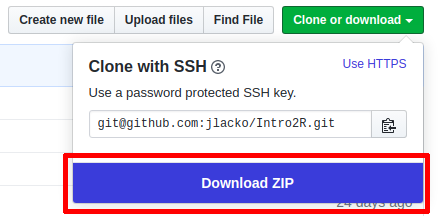

# Materiály ke školení Úvod do jazyka R

Podkladové materiály ke školení Úvod do jazyka R od Jindry Lacka. 

Repozitář je online na https://rstudio.cloud/project/499564; pro získání lokální kopie využijte tlačítko Clone or download. Kdo se cítí použije git, kdo se necítí použije zip - obojí platí stejně.

  

Struktura repozitáře je jednoduchá:  

* `./prezentace` obsahuje průvodní slidy ve formátu Libre Office Impress
* `./cvičení` obsahuje cvičení ve formátu R Markdown, respektive R
* `./data` obsahuje pokdladová data ke cvičení (otevřená data ČSÚ + plný text Čapkovo hry Rossum's Universal Robots)
* `./taháky` obsahuje výběr základních Cheatsheets z https://rstudio.com/resources/cheatsheets/
* `./extras` obsahuje rozšiřující materiál ke kurzu

*Fine print*: The William Sealy Gosset & his manager discussion from `/prezentace/0 - úvod.odp` is taken from Garrett Grolemund's talk [R Markdown: The Bigger Picture](https://github.com/garrettgman/rmarkdown-the-bigger-picture) presented on the rstudio::2019 conference.

